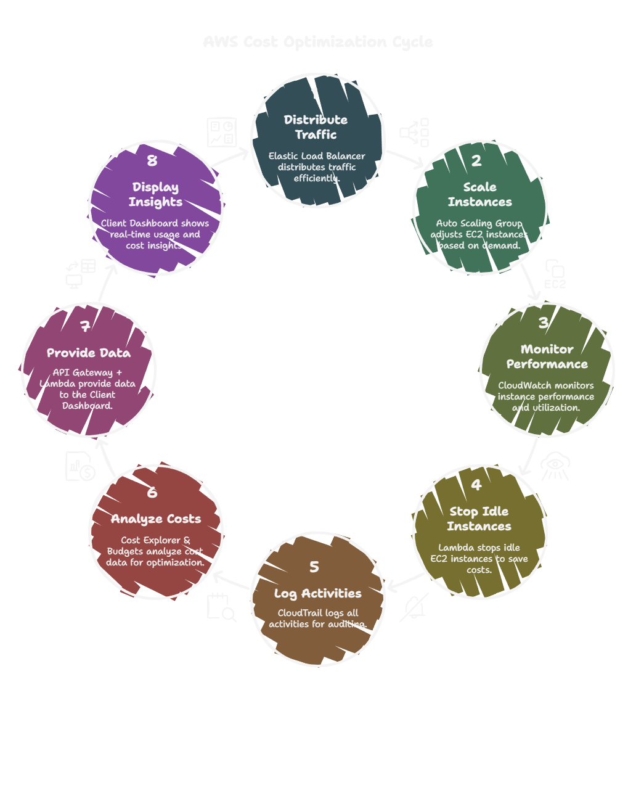
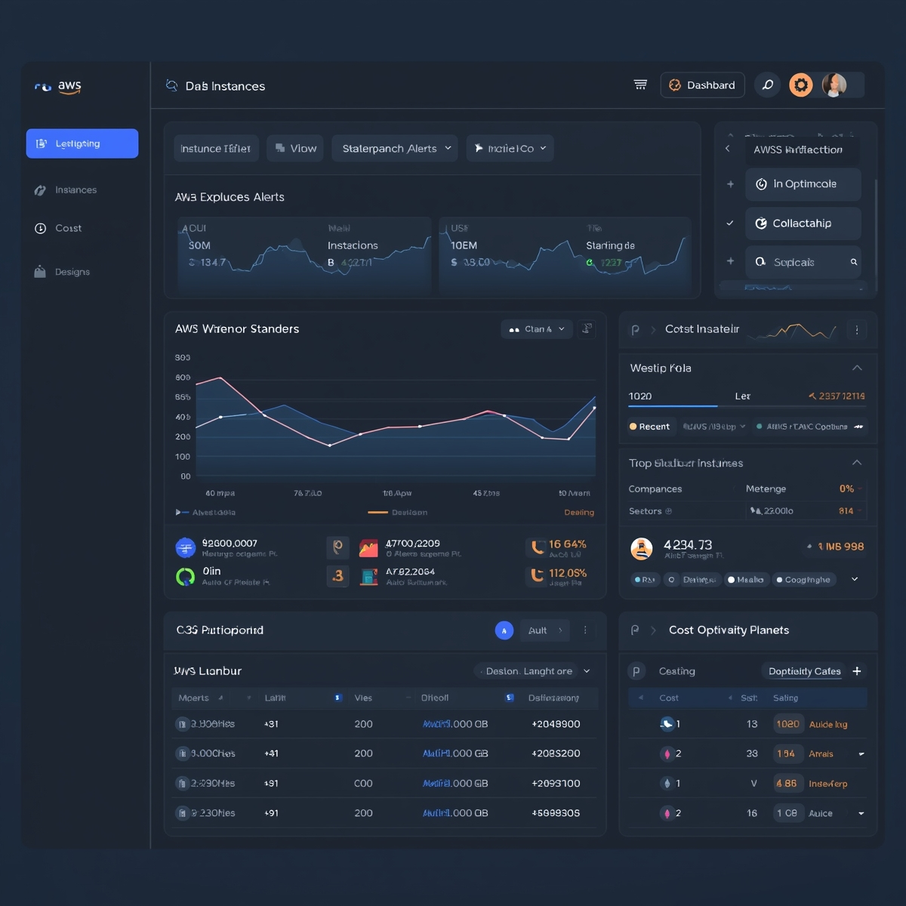

# Automated AWS Cloud Management & Cost Optimization Dashboard

## 📌 Project Overview
This project is a **smart AWS cloud management system** that automatically optimizes resources, balances traffic, monitors performance, and reduces costs using FinOps practices. It also provides a **client-facing dashboard** for real-time visibility into usage, logs, and costs.

---

## 🚀 Features
- **Auto Instance Management** – Automatically stops idle EC2 instances using CloudWatch alarms and AWS Lambda.
- **Load Balancing & Auto Scaling** – Distributes workloads with Elastic Load Balancer and dynamically scales instances with Auto Scaling Groups.
- **Real-Time Monitoring** – Integrated CloudWatch for metrics, alarms, and alerts.
- **Logging & Auditing** – Implemented CloudTrail with centralized log storage in S3.
- **Cost Optimization (FinOps)** – Used Cost Explorer, Budgets, and Trusted Advisor for cloud cost management.
- **Client Dashboard & API** – Built with API Gateway + Lambda, with a web dashboard hosted on CloudFront + S3.

---

## 🛠️ AWS Services Used
- **Compute & Networking**: EC2, Auto Scaling, Elastic Load Balancer
- **Monitoring & Automation**: CloudWatch, Lambda, CloudTrail
- **Storage & Logs**: Amazon S3
- **FinOps**: AWS Cost Explorer, Budgets, Trusted Advisor
- **API & Dashboard**: API Gateway, Lambda, CloudFront
- **Security**: IAM

---

## 📊 Architecture Flow


---

## 🖥️ Dashboard Preview


---

## 📂 Project Structure
```
├── /dashboard-ui        # Frontend (static site hosted on S3 + CloudFront)
├── /lambda-functions    # Automation + API backend
├── /cloudformation      # Infra-as-Code templates
├── README.md            # Documentation
```

---

## ⚡ Setup Instructions
1. Clone the repository:
   ```bash
   git clone https://github.com/your-username/aws-cloud-dashboard.git
   ```
2. Deploy infrastructure using AWS CloudFormation or Terraform.
3. Configure **IAM roles & permissions** for Lambda and CloudWatch.
4. Upload frontend files to **S3** and connect to **CloudFront**.
5. Access the **dashboard URL** to monitor instances, costs, and logs.

---

## 📈 Outcomes
- Reduced AWS costs by automatically shutting down unused instances.
- Improved reliability through auto scaling and load balancing.
- Delivered real-time monitoring and cost visibility via a client-friendly dashboard.

---

## 🔒 Security
- IAM roles with least-privilege access.
- CloudTrail logging for auditing.
- Encrypted S3 storage for logs and reports.

---

## 🤝 Contribution
Feel free to fork this repo, raise issues, or submit PRs for improvements.

---

## 📜 License
This project is licensed under the MIT License.
